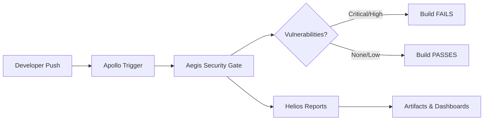

# ORBIT-SEC Architecture

## System Overview

ORBIT-SEC is a DevSecOps CI/CD security pipeline that automates vulnerability scanning and secret detection for Python applications. The system follows a fail-fast security model where critical vulnerabilities block deployments.



## Component Architecture

### Apollo (Pipeline Orchestrator)

**Responsibility:** Trigger and coordinate security scans on code changes

**Technology:** GitHub Actions

**Inputs:**
- Git push events to main branch
- Pull request events
- Manual workflow triggers

**Outputs:**
- Workflow execution status
- Build pass/fail decisions
- Triggered downstream scans

**Configuration:** `.github/workflows/security.yml`

**Behavior:**
- Activates on every code change
- Sets up execution environment (Python 3.9, dependencies)
- Orchestrates Aegis security checks
- Invokes Helios for reporting
- Enforces security policy (fail on CRITICAL/HIGH)

---

### Aegis (Security Gate)

**Responsibility:** Enforce security standards and block vulnerable code

**Technology:** Trivy (vulnerability scanner) + Gitleaks (secret detection)

**Inputs:**
- Source code repository
- Dependency manifest (`requirements.txt`)
- Docker configuration files
- Git history

**Outputs:**
- Pass/fail security decision
- Vulnerability findings (CVE list)
- Secret detection results
- Severity classifications

**Scanning Strategy:**

1. **Dependency Scanning (Trivy)**
   - Scans `requirements.txt` for known CVEs
   - Checks CRITICAL and HIGH severity vulnerabilities
   - Fails build immediately on findings (exit-code: 1)

2. **Configuration Scanning (Trivy)**
   - Analyzes Dockerfile for misconfigurations
   - Checks for security best practices
   - Non-blocking (informational)

3. **Secret Detection (Gitleaks)**
   - Scans entire repository for exposed credentials
   - Detects API keys, passwords, tokens
   - Fails build on any secret detection

**Enforcement Policy:**
- ❌ CRITICAL severity → Build FAILS
- ❌ HIGH severity → Build FAILS
- ⚠️ MEDIUM severity → Build passes (warning)
- ✅ LOW severity → Build passes

---

### Hermes (Policy Engine) - *Future Component*

**Responsibility:** Define and enforce custom security policies

**Technology:** YAML configuration files, Open Policy Agent (OPA)

**Planned Capabilities:**
- Custom CVE allowlists
- Organization-specific compliance rules
- License policy enforcement
- Automated remediation policies

**Status:** Planned for Week 4+

---

### Helios (Reporting & Visibility)

**Responsibility:** Generate human-readable security reports

**Technology:** Trivy HTML templates, GitHub Actions artifacts

**Inputs:**
- Trivy scan results (JSON/table format)
- Gitleaks findings
- Build metadata

**Outputs:**
- HTML vulnerability reports (`trivy-report.html`)
- Text-based scan summaries (`trivy-results.txt`)
- GitHub Actions job summaries
- Downloadable artifacts (30-day retention)

**Report Contents:**
- Vulnerability details (CVE ID, severity, description)
- Affected packages and versions
- Remediation guidance (upgrade paths)
- Scan timestamp and commit hash

---

## Data Flow Sequence

```
1. Developer commits code
   ↓
2. GitHub webhook triggers Apollo
   ↓
3. Apollo checks out code and sets up Python environment
   ↓
4. Aegis: Trivy scans dependencies (requirements.txt)
   ├─ Finds CVE-2023-30861 in Flask==2.0.1 [CRITICAL]
   └─ Build immediately FAILS
   ↓
5. Aegis: Gitleaks scans for secrets
   └─ No secrets found
   ↓
6. Helios generates reports (even on failure)
   ├─ Creates trivy-report.html
   └─ Uploads artifacts to GitHub
   ↓
7. Apollo marks workflow as FAILED
   ↓
8. Developer receives notification with report link
```

## Security Model

### Fail-Fast Philosophy

ORBIT-SEC prioritizes **prevention over detection**:

- **No auto-fix:** Vulnerabilities require human review and intentional upgrades
- **Transparent failures:** Developers see exactly what blocked their build
- **Shift-left security:** Issues caught before merge, not in production
- **Zero-trust dependencies:** Every library version is validated

### Threat Coverage

| Threat Type | Detection Method | Severity Threshold |
|-------------|------------------|-------------------|
| Known CVEs in dependencies | Trivy database scan | CRITICAL/HIGH |
| Exposed secrets (API keys) | Gitleaks pattern matching | ANY |
| Docker misconfigurations | Trivy config scan | Info only |
| Outdated packages | Trivy version check | CRITICAL/HIGH |

### False Positive Handling

Currently: All findings block builds (Week 1-2 intentional vulnerabilities)

Future (Week 4):
- Hermes policy engine will support CVE allowlisting
- Risk acceptance workflow for approved exceptions
- Expiring waivers with mandatory review dates

## Technology Stack

### Core Tools

- **Trivy** (Aqua Security)
  - Database: 200,000+ CVEs
  - Update frequency: Daily
  - Language support: Python, Go, Rust, Node.js, etc.

- **Gitleaks** (Gitleaks LLC)
  - Detection rules: 1000+ patterns
  - Entropy analysis for custom secrets
  - Git history scanning

### Infrastructure

- **GitHub Actions**
  - Runner: ubuntu-latest
  - Execution time: ~2-3 minutes per scan
  - Artifact storage: 30 days

## Future Enhancements

### Week 3: Container Image Scanning
```yaml
- name: Scan Docker image
  uses: aquasecurity/trivy-action@master
  with:
    scan-type: 'image'
    image-ref: 'orbit-sec:latest'
```

### Week 4: Infrastructure as Code (IaC)
- Terraform security scanning
- CloudFormation template validation
- Kubernetes manifest checks

### Week 5: SBOM Generation
- Software Bill of Materials (SBOM) creation
- CycloneDX or SPDX format
- Supply chain transparency

### Week 6: Athena AI Remediation (Concept)
- AI-powered vulnerability analysis
- Automated upgrade recommendations
- Risk scoring and prioritization

## Performance Metrics

**Current Pipeline Performance:**
- Checkout: ~5 seconds
- Python setup: ~15 seconds
- Dependency scan: ~30 seconds
- Secret scan: ~10 seconds
- Report generation: ~5 seconds
- **Total: ~65 seconds**

**Scalability:**
- Monorepo support: ✅ (scan-ref configurable)
- Parallel scans: ✅ (steps run concurrently)
- Caching: ⚠️ (not yet implemented)

## Troubleshooting

### Common Issues

**1. Trivy fails with "database not found"**
- Cause: GitHub Actions runner network issue
- Solution: Trivy auto-downloads DB on first run (retry)

**2. Gitleaks detects false positive**
- Cause: String pattern matches secret regex
- Solution: Add `.gitleaksignore` file with line exception

**3. Build fails but reports not uploaded**
- Cause: `if: always()` condition missing
- Solution: Already configured in security.yml

## References

- [Trivy Documentation](https://aquasecurity.github.io/trivy/)
- [Gitleaks Documentation](https://github.com/gitleaks/gitleaks)
- [GitHub Actions Security Best Practices](https://docs.github.com/en/actions/security-guides)
